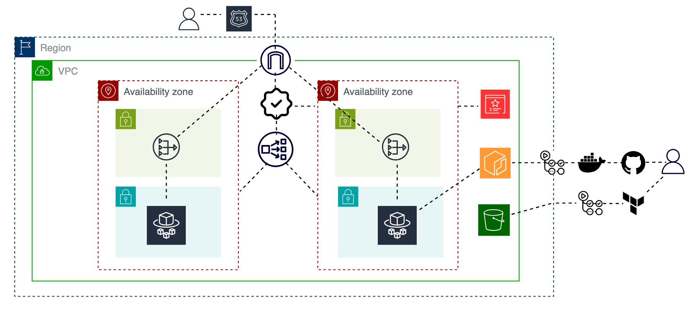

# Gatus System Monitoring Dashboard w/ ECS, IaC, CI/CD & Security Scanning

[](#)
[](#)
[](#)
[](#)

## Gatus Health Dashboard

This project deploys [Gatus](https://github.com/TwiN/gatus), a developer-oriented health dashboard that gives you the ability to monitor your services. To bring this application to life, I decided to leverage [ECS Fargate](https://docs.aws.amazon.com/AmazonECS/latest/developerguide/AWS_Fargate.html), a serverless container platform that removes the need to manage servers or clusters of Amazon EC2 instances allowing you to focus on cpu/memory requirements, networking and IAM policies.

## Architecture Overview

After evaluating the trade-offs between high availability  and cost optimization architectural approaches, we chose a [high-availability design](https://aws.amazon.com/blogs/networking-and-content-delivery/using-nat-gateways-with-multiple-amazon-vpcs-at-scale/) to ensure the environment is production-ready. For example, we deployed NAT Gateways in each Availability Zone to avoid a single point of failure (SPOF). The architecture runs in a VPC across two Availability Zones with public and private subnets for resource isolation, and the custom domain `xasan.site` is managed via route 53 hosted zone. An Application Load Balancer (ALB) distributes traffic to ECS Fargate tasks in private subnets, enforces HTTP → HTTPS redirection, and secures traffic with ACM-managed TLS certificates Infrastructure is fully automated using Terraform and GitHub Actions, with pinned versions for stability, Docker images scanned via Trivy,an open-source vulnerability scanner for containers, and Terraform code is validated with tfsec, an open-source static analysis tool designed to identify potential security vulnerabilities, and TFLint, an open-source Terraform linter designed to detect errors and enforce Terraform best practices.

## Architecture Diagram



# Terraform Structure

```
gatus-ecs-app/
├── .github/
│   └── workflows/
│       ├── build.yml
│       ├── tf-apply.yml
│       ├── tf-destroy.yml
│       └── tf-plan.yml
├── application/
│   ├── Dockerfile
│   └── config/
│       └── config.yaml
└── terraform/
    ├── environment/
    │   └── dev/
    │       ├── backend.tf
    │       ├── main.tf
    │       ├── outputs.tf
    │       ├── provider.tf
    │       └── variables.tf
    └── modules/
        ├── acm/
        │   ├── main.tf
        │   ├── outputs.tf
        │   └── variables.tf
        ├── dns/
        │   ├── main.tf
        │   └── variables.tf
        ├── ecs/
        │   ├── main.tf
        │   └── variables.tf
        ├── iam/
        │   ├── main.tf
        │   ├── outputs.tf
        │   └── variables.tf
        ├── loadbalancer/
        │   ├── main.tf
        │   ├── outputs.tf
        │   └── variables.tf
        └── network/
            ├── main.tf
            ├── outputs.tf
            └── variables.tf
```

## Backend Provisioning

Terraform state is stored remotely in an S3 backend, ensuring that infrastructure changes are persistent and shared across teams. To prevent conflicts when multiple users or pipelines apply changes, state locking is enabled. Previously, this required a separate DynamoDB table, but with recent AWS updates, S3 now natively supports state locking directly on the [S3 bucket](https://docs.aws.amazon.com/prescriptive-guidance/latest/terraform-aws-provider-best-practices/backend.html?utm_source=chatgpt.com), simplifying the process by reducing the number of resources needed to deploy and manage Terraform state.

Following best practices, the backend resources were provisioned manually via the AWS CLI before being referenced in Terraform, avoiding the bootstrapping issue where Terraform would otherwise need to use backend that it is also creating.

The backend is secured using server-side encryption, versioning (to allow state rollback), and public access blocks to prevent unintended exposure. These controls ensure that sensitive infrastructure state is protected while maintaining availability and recoverability. This approach provides safe, consistent, and collaborative infrastructure management aligned with production-ready practices.

## Deployment Workflow

Deployment is fully automated using GitHub Actions. Each workflow handles a distinct part of the lifecycle:

- `build.yml` builds and pushes Docker images to Amazon ECR with pinned tags for reproducibility.

- `tf-plan.yml` runs terraform plan to preview infrastructure changes.

- `tf-apply.yml` safely applies infrastructure updates to AWS.

- `tf-destroy.yml` is available for controlled teardown of resources.

As part of the pipeline, Docker images are scanned with [Trivy](https://trivy.dev/latest/docs/) to detect vulnerabilities, and Terraform code is validated with tfsec and TFLint to enforce security best practices and catch potential issues early. This results in repeatable, versioned, and secure deployments with a clear audit trail.