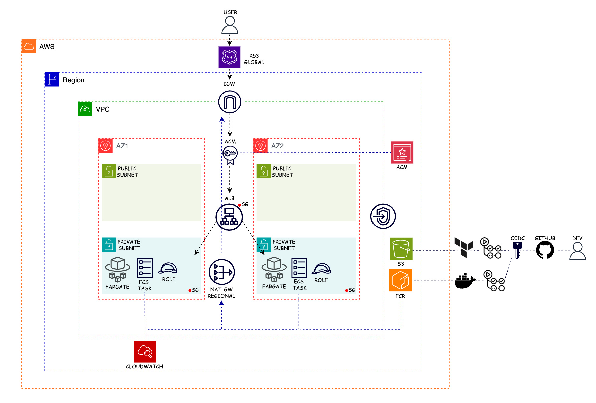
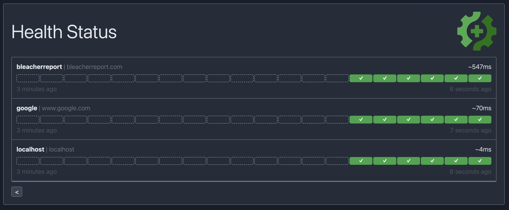
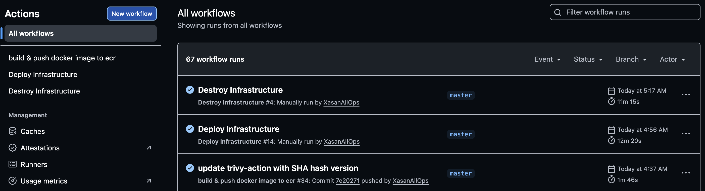
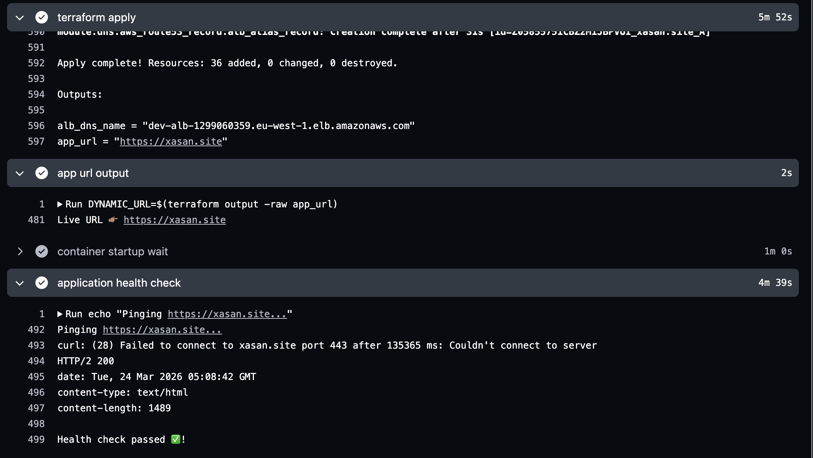

# Deploying Gatus on AWS
[](#)
[](#)
[](#)
[](#)

## Gatus Health Dashboard

This project deploys [Gatus](https://github.com/TwiN/gatus), a developer-oriented health dashboard that gives you the ability to monitor your services.

## Overview

A containerised application deployment on AWS ECS Fargate, demonstrating tiered Infrastructure as Code (IaC) best practices, secure CI/CD automation using short-lived OIDC credentials, and a defence-in-depth security posture. The infrastructure features a multi-AZ VPC, secure HTTPS routing via an Application Load Balancer and ACM, custom Route 53 DNS, and cost-optimised network egress utilising a single Regional NAT Gateway alongside an S3 VPC Endpoint for direct, zero-cost ECR image layer pulls.

## Architecture Diagram



## Key Features

* Decoupled Terraform (IaC): Split into bootstrap and core modules to resolve cyclical dependencies. The bootstrap layer provisions critical prerequisites required to unlock the automated deployment of the core infrastructure.
* Serverless Compute (Fargate): Utilised AWS ECS Fargate to abstract away underlying EC2 infrastructure, eliminating OS patching and operational overhead while enabling seamless scaling.
* Keyless CI/CD: Automated GitHub Actions workflows driven by secure, short-lived AWS OIDC tokens instead of static access keys.
* Cost-Optimised Egress: A single NAT Gateway handles lightweight API calls, while a free S3 VPC Endpoint routes heavy ECR image layers to eliminate data charges.
* Hardened Containers: Multi-stage scratch Docker builds that reduce the application attack surface to near-zero.
* Shift-Left Security: Automated pipeline quality gates using Trivy (vulnerability scanning) and Checkov (IaC static analysis).
* High-Availability & Secure Routing: A Multi-AZ deployment with an Application Load Balancer targeting private subnets, featuring forced HTTP → HTTPS redirection via ACM and custom Route 53 DNS.

## Terraform Structure

```
Gatus-ECS-Terraform-Docker-GA-AWS/
├── .github/
│   └── workflows/
│       ├── build.yml
│       ├── tf-deploy.yml
│       └── tf-destroy.yml
│
├── application/
│   ├── Dockerfile
│   ├── .dockerignore
│   └── config/
│       └── config.yaml
│
├── bootstrap/
│   ├── main.tf
│   ├── provider.tf
│   ├── variables.tf
│   ├── outputs.tf
│   ├── terraform.tfvars
│   └── modules/
│       ├── ecr/
│       ├── s3/
│       └── iam/
│
├── terraform/
│   ├── environment/
│   │   └── dev/
│   │       ├── backend.tf
│   │       ├── main.tf
│   │       ├── provider.tf
│   │       ├── variables.tf
│   │       ├── outputs.tf
│   │       └── terraform.tfvars.example
│   │
│   └── modules/
│       ├── acm/
│       ├── dns/
│       ├── ecs/
│       ├── iam/
│       ├── loadbalancer/
│       └── network/
│
├── README.md
└── .gitignore
```

## Cost Optimisation

* Replaced expensive Multi-AZ NATs with a single Regional NAT Gateway and an S3 VPC Endpoint to route gigabytes of ECR image pulls over the internal network for free.
* Utilised ECS Fargate to pay strictly for consumed CPU/Memory, completely eliminating idle EC2 instance waste.
* Multi-stage scratch Docker builds produce ultra-small application images (`35 MB`), slashing ECR storage fees and accelerating deployment times.
* Implemented Amazon ECR Lifecycle Policies to automatically purge stale and untagged Docker images, preventing unbounded storage growth and reducing baseline AWS costs.

## Security

* Applied strict Role-Based Access Control (RBAC) across the environment. Pipeline roles and ECS Task Execution roles are scoped to the absolute minimum permissions required.
* Completely eliminated static AWS keys. GitHub Actions authenticates via OIDC to assume short-lived, strictly scoped IAM roles.
* Fargate tasks are isolated in Private Subnets. All internet traffic is mediated by an ALB that enforces encryption in transit via automatic HTTP-to-HTTPS redirection and ACM-managed TLS certificates.
* The scratch Docker image contains no OS shell or package manager, reducing the container attack surface to near-zero.
* Pipelines enforce mandatory Trivy scans for container CVEs and Checkov static analysis to block Terraform misconfigurations.
* Terraform state is secured in an encrypted S3 bucket with all public access strictly blocked.

## Prerequisites

Before deploying this infrastructure, ensure you have the following:

- Terraform (v1.6.0+): Installed locally for the initial bootstrap.

- AWS CLI: Installed and authenticated (only required for Tier 0 bootstrap).

- Docker Desktop: Required for local testing (Step 1).

- GitHub Account: To host the repository and run OIDC-driven pipelines.

- Public Domain: A registered domain managed via Route 53 (or an external provider) to support the ALB’s HTTPS listener and ACM certificate.

## Deployment Guide

This guide walks you through testing the application locally, bootstrapping the foundational AWS infrastructure, and triggering the automated CI/CD pipelines.

### Step 1: Local Development & Testing

Verify the Gatus application builds and runs correctly on your local machine.

**1. Clone the repository**
```bash
git clone https://github.com/XasanAllOps/Gatus-ECS-Terraform-Docker-GA-AWS.git
cd Gatus-ECS-Terraform-Docker-GA-AWS/application
```

**2. Build and run the Docker Image**

```bash

# -- Make sure Docker engine is running
docker info
```
Troubleshooting: If you receive "Server: failed to connect to the docker API", Docker is not running. Please launch Docker Desktop (Mac/Windows) or start the service (Linux).

```bash
# -- Build the multi-stage image
docker build -t gatus-local .


# -- Run the container in the background (detached)
docker run -d -p 8080:8080 --name gatus-app gatus-local
```

**3: Verify the deployment:**
```bash
# -- Open your web browser and navigate to http://localhost:8080 to ensure the local Gatus dashboard is active.
```

**4: Clean up resources:**
```bash
# -- Stop and remove local container
docker stop gatus-app && docker rm gatus-app
```

### Step 2: Bootstrap AWS Foundation

To resolve the "chicken-and-egg" deployment cycle, you must manually deploy the bootstrap infrastructure. This provisions the S3 remote state bucket, the ECR repository, and the GitHub OIDC IAM roles.

**1. Authenticate locally:** 

Ensure your AWS CLI is installed and authenticated with administrator credentials.

**2. Navigate to bootstrap directory:**

```bash
cd ../bootstrap
```

**3. Configure your environment variables:**

Modify the values in `terraform.tfvars` to match your setup:

```bash
aws_region       = "enter AWS region>"
project_name     = "create project name>"
s3_bucket_prefix = "add a prefix>"
github_repo      = "github_username/github_repository"
```

**4. Deploy the boostrap infrastructure:**

Execute Terraform to provision the bootstrap resources:

```bash
terraform init
terraform plan
terraform apply --auto-approve
```

**5. View the Terraform outputs:**

Upon a successful apply, Terraform will display your resource identifiers. Keep this terminal window open, as you will need these specific values to configure your GitHub repository and core infrastructure in the next steps.

- `github_app_role_arn` (Required for GitHub Secrets)

- `github_infra_role_arn` (Required for GitHub Secrets)

- `ecr_repository_url` (Required for GitHub Variables)

- `bucket_name` (Required for your backend.tf file)

### Step 3: Configure GitHub Actions (CI/CD)

Before pushing your code, you must establish the OIDC trust relationship by adding your Terraform outputs from `Step 2` to your GitHub repository.

**1. Navigate to your repository settings:** 

Go to Settings > Secrets and variables > Actions.

**2. Add Repository Secrets:**

Select the Secrets tab and create the following (this split enforces strict RBAC between application and infrastructure):

- `AWS_APP_ROLE_ARN`: Paste your *github_app_role_arn* output.

- `AWS_INFRA_ROLE_ARN`: Paste your *github_infra_role_arn* output.

**3. Add Repository Variables:**

Select the Variables tab and create the following:

- `AWS_REGION`: Your target region (e.g., eu-west-2).

- `ECR_REPOSITORY_URL`: Paste your *ecr_repository_url* output.

### Step 4: Configure Core Variables & Remote State

Before GitHub Actions can deploy your core infrastructure, you must tell the core Terraform module where your state bucket is located and provide your specific environment variables.

**1. Navigate to the core directory:**

```bash
cd ../environment/dev
```

**2. Update your backend configuration:**

Open `backend.tf` and replace the ".." with your bucket name from Step 2 and AWS region:

```bash
terraform {
  backend "s3" {
    bucket         = ".." 
    key            = "dev/ecs/tf.state" # -- KEEP
    region         = ".."
    encrypt        = true
  }
}
```

**3. Configure environment variables:**

```bash
cp terraform.tfvars.example terraform.tfvars
```

Open terraform.tfvars and update the values with your project details


**4. Commit and push:**

Once you have edited your `backend.tf` and `terraform.tfvars` files. Navigate back to the root of the project, commit your changes, and push:

```bash
cd ../../../ # -- back to the root of the Git repository
git add .
git commit -m "chore: configure deployment variables & update backend.tf"
git push origin main # -- or master
```

### Step 5: Automated Deployment & Validation

Once your code is pushed, the integrated CI/CD pipeline takes over. The deployment is split into two automated phases to ensure maximum security and stability.

**1. Build & Push (build.yml):**

This workflow triggers automatically on any push to master involving the application/ directory. It performs the following quality gates:

- Security Scan: Uses Trivy to check the Docker image for Critical/High vulnerabilities.

- Functional Test: Spins up the container inside the GitHub Runner and performs a curl health check to verify the app is responding.

- ECR Push: Only after passing all tests is the image pushed to your AWS ECR repository.

**2. Core Infrastructure Deployment (tf-deploy.yml):**

This workflow triggers automatically once the Build & Push workflow succeeds.

- Static Analysis: Runs Checkov to ensure your Terraform code meets AWS security best practices.

- Automated Apply: Provisions all our resources 

- Live Health Check: Once deployed, the pipeline waits for the Fargate tasks to stabilize and pings your Live URL to confirm a successful production rollout.

**3. Verify Production:**

Check the "Summary" page of your GitHub Action run. The pipeline will output your Live URL. Click it to see your Gatus dashboard live on the internet.

### Step 6: Secure Teardown

To avoid incurring AWS costs when you are finished testing, follow this specific two-stage teardown process.

**1. Destroy Core Infrastructure (tf-destroy.yml):**

- Navigate to the Actions tab in GitHub and select the Destroy Infrastructure workflow.

- Click Run workflow.

- Safety Lock: You must type `destroy` into the input box to confirm. This prevents accidental deletions of your production environment.

**2. Destroy Bootstrap Foundation (Local):**

Because the bootstrap layer manages the S3 state bucket and ECR repository used by the pipeline, it must be removed last from your local terminal:

```bash
cd terraform/bootstrap
terraform destroy --auto-approve
```

## Images

#### Application Live



#### GitHub Actions (CI/CD) Workflows



#### Application Health Check




## Future Improvements

- As the applications scales, to introduce AWS WAF to protect ALB endpoints from common attacks and reduce latency with CDN for edge users.

- Configure an alert system for failed tasks with SNS & auditing and anomaly detection with CloudTrail + GuardDuty.

- Adopt a Git-flow strategy where developers merge and push to the dev branch to trigger automated Terraform workflows in dev. Once verified, merge `dev` into `main`, run workflow and select `staging` workflows. After successful validation in staging, a manual approval gate is required to execute the final terraform apply in the production environment.

- Integrate 3rd party tools like Prometheus and Grafana for observability

- Look into implementing Terragrunt, an open-source wrapper for Terraform designed to keep the codebase DRY and simplifies the management of multi-environment infrastructure. 
